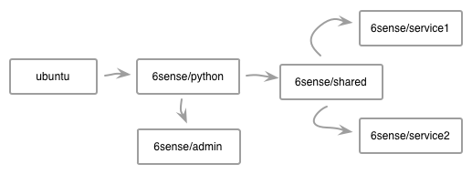

#Motivation:

Docker has a wonderful mechanism for distributing shared libraries or 
other common resources to  images at build time.  Simply create a 
[Dockerfile](https://docs.docker.com/reference/builder/) 
that builds your shared library first. Then create seperate Dockerfiles
for each of your other services. Each of those images use your shared image
as their base image in the [FROM](https://docs.docker.com/reference/builder/#from)
clause.

A typical distributed project at 6Sense looks something like this.

And the directory structure would look something like

	$ find .
    ./shared/python/Dockerfile
    ./shared/python/setup.py
    ...
    ./shared/libs/Dockerfile
    ./shared/libs/src
    ...
	./service1/Dockerfile
	...
	./service2/Dockerfile
	...
	./admin/Dockerfile
	...

However, Docker leaves it up to you to build these images in the right order.  If you checked out this code directly from git and tried to build
`service1` it would fail. It depends on `6sense/shared` which hasn't been built yet. In fact a typical session by hand would looks something like this.

	$ cd <project dir>
	$ docker build -t 6sense/python ./shared/python
	$ docker build -t 6sense/shared ./shared/libs
	$ docker build -t 6sense/admin ./admin
	$ docker build -t 6sense/service1 ./service1
	$ docker build -t 6sense/service1 ./service2
	
Now that's annoying, but manageable. As experinced Unix developers, we started off with the naive approach of using a `Makefile` to build all the images in the right order.

But we kept running into other problems. We like to develop using feature branches. Often during the same day we'd switch back and forth between several git branches, make changes to the various images, rebuild, test think everything was hunky dory. Until we'd run into strange errors. Only after several frustrating hours of debuging would we realize we pushed images from mixed branches or built images in the wrong order.

The solution to that problem was to include the git branch name in all the images we built as a tag, but also meant we  had to update the Dockerfile and ensure the `FROM` included the right tag as in `FROM 6sense/shared:<some branch>`. But this too had problems, if you had two developers working on the same branch.

Our build scripts kept growing ever more elaborate. Then it dawned on us that most of the information needed to build and tag images properly is already present in some form either in the Dockerfile or within git itself.

What we really wanted was a simple tool that would read all the Dockerfiles in a git checkout, determine the proper build order, then build and tag them. And if a base image changed we wanted to make sure all the dependent images got rebuilt in turn. Being that building could be slow (even with Docker's awsesome build caching), if there were no changes to certain images in the build group, simply tag them with the latest git revision.

It didn't exist, so we built [Shipwright](index.md)
